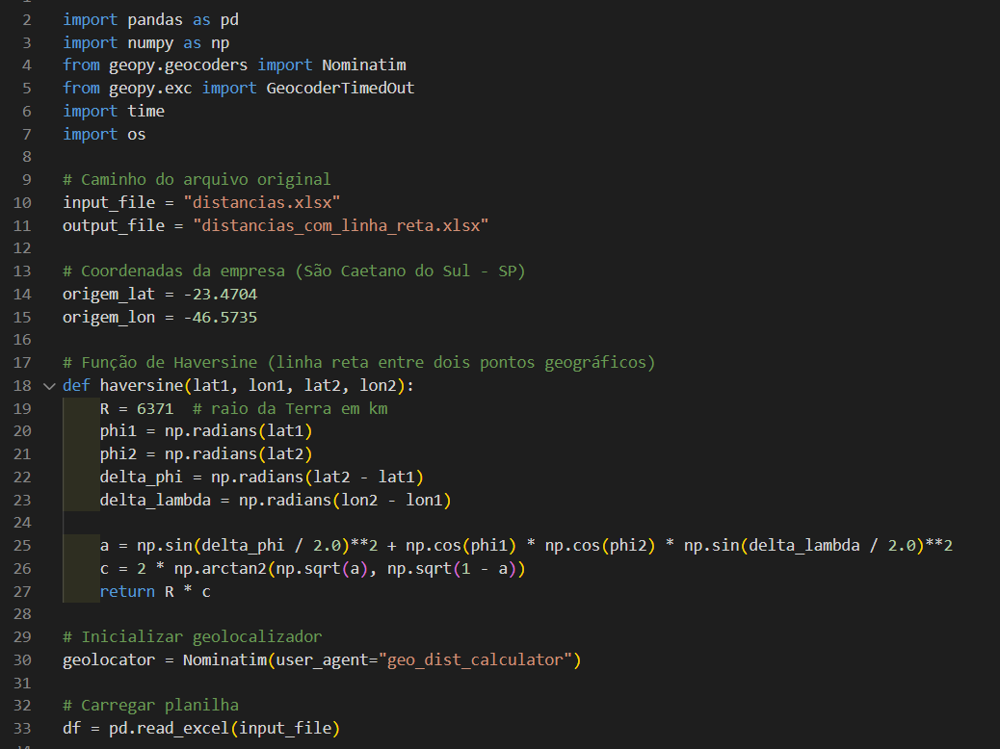

# Projeto Distâncias

<p align="center">
  
  
  
</p>

Calcula a distância em linha reta entre São Caetano do Sul - SP e várias cidades brasileiras usando:

- 🐍 Python
- 🌍 Fórmula de Haversine
- 📊 Planilhas Excel
- 📌 Geolocalização via OpenStreetMap

## 🖼️ Exemplo de código em uso



## 📂 Aplicações
Ideal para análises logísticas, planejamento de rotas e visualização de dados geográficos.

## 🚀 Como rodar

1. Instale as dependências:
   ```bash
   pip install pandas geopy openpyxl

---

👩‍💻 Desenvolvido por [Letícia Monares]([https://www.linkedin.com/in/seu-user-aqui](https://www.linkedin.com/in/leticia-monares-875493182/))  
📫 Entre em contato: monares.leticia@gmail.com
